# 试玩广告脚本：横移解锁增员 - 自动火力清理尸潮

> 参考视频：YouTube Shorts `MBUQS-6iN-A`，33.061 秒，608×1080，30 FPS，竖屏。  
> 规则更正：`3` 与 `666` 是需要累计对应攻击次数才能打开的能力锁，不是我方/敌方数量；初始只有 1 名主角；两侧所有 `+N` 数字牌都只表示增加 N 名小兵，不提供火力倍率或其他技能；小兵自动索敌攻击；小队只有横向移动；唯一失败条件是主角死亡。

## 封面

- **玩法卖点**：末日跑酷 + 横向选择能力锁 + 自动索敌射击 + 即时增员。
- **一句话体验**：玩家控制单个主角在竖屏道路上左右横移，自动攻击沿途僵尸并积累攻击次数，打破 `3`、`666` 攻击次数锁后领取两侧 `+N` 增员牌，立即增加 N 名小兵，最终击败巨型僵尸。
- **核心操作**：玩家只控制小队横向移动；纵向推进由场景滚动完成。主角和已解锁小兵自动索敌、转向和攻击。
- **大纲**：
  1. 开局只有 1 名主角，前方同时出现僵尸与两侧数字能力锁。
  2. 主角自动向射程内最近敌人开火，每次有效攻击累计 1 次攻击进度。
  3. 达到 `3` 次攻击后，早期能力锁打开，蓝色 `+N` 增员牌进入可领取状态。
  4. 玩家横移领取蓝牌，必须在同一反馈节拍内立即增加牌面标注的 N 名小兵、扩展编队并增加枪线。
  5. 继续攻击累积更高门槛；`666` 是长期强化目标，不代表敌方总量。
  6. 小兵自动索敌攻击，玩家通过左右横移选择能力锁并躲避伤害。
  7. 巨型僵尸进入近景后，小队持续自动集火；击败 BOSS 触发成功结算。
- **成功条件**：巨型僵尸死亡，且主角存活。
- **唯一失败条件**：主角 HP 归零。小兵死亡、敌人穿过某条线、错过能力牌或时间耗尽均不能直接判失败。
- **重试规则**：首次死亡可 `TRY AGAIN` 原地重开 1 次；第二次死亡显示 CTA。

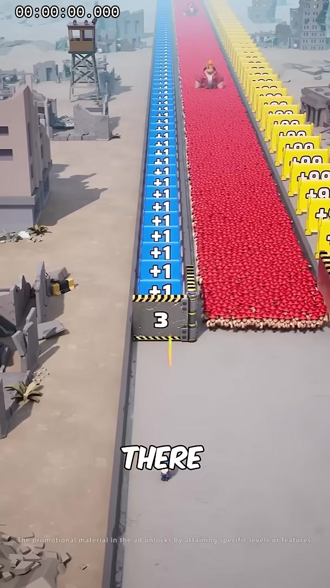

## 参考视频与规则边界

| 文件/链接 | 时长/规格 | 备注 |
| --- | --- | --- |
| `reference/incoming/planner-53928cd9-5cba-4921-8112-4ab0662269b3.mp4` | 33.061 秒，608×1080，30 FPS | 已按 0.5 秒间隔抽取 66 帧 |
| `https://www.youtube.com/shorts/MBUQS-6iN-A` | 原始来源 URL | 本案使用已下载本地文件 |
| `docs/design/youtube-MBUQS-6iN-A-frames/` | 14 张代表帧 | 覆盖开局、能力锁、自动攻击、BOSS 和终局 |

### 数字含义更正

| 画面元素 | 正确含义 | 禁止解释 |
| --- | --- | --- |
| `3` | 需要累计 3 次有效攻击才能解锁的早期强化能力锁 | 不是初始角色数量，也不是“我方 3 人” |
| `666` | 需要累计 666 次有效攻击才能解锁的长期强化能力锁 | 不是敌方总量，不与 `3` 构成对抗关系 |
| 两侧连续 `+N` 数字牌 | 牌面数字 N 就是领取后增加的小兵数量 | 不提供伤害倍率、射速倍率或其他技能 |
| 蓝色 `+N` 牌 | 领取后立即增加 N 名小兵 | 变化必须当帧出现 |
| 黄色 `+N` 牌 | 领取后立即增加 N 名小兵 | 与蓝牌规则相同，只是牌面 N 可以更大 |

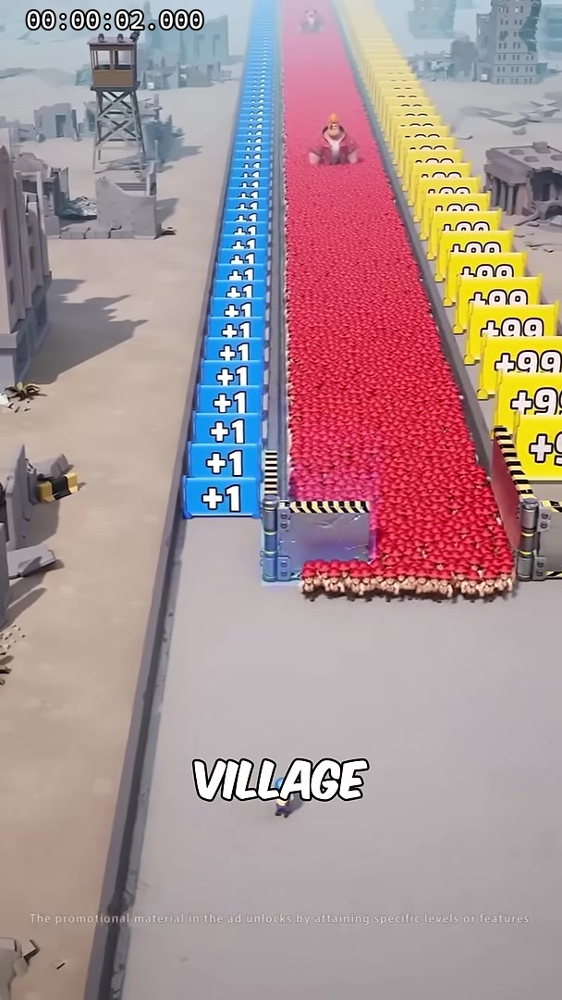

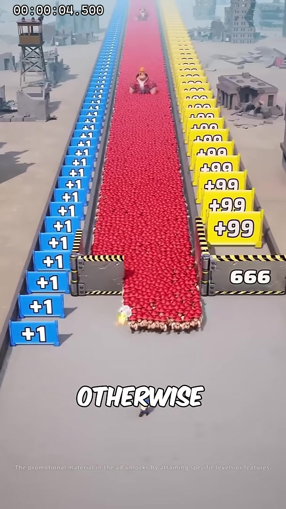

## 分析结论

- **目标结构**：战斗成长型。循环不是“削减敌方 666”，而是“自动攻击累计次数 → 打开 3/666 能力锁 → 横移领取 +N 增员牌 → 立即增加 N 名小兵 → 更多小兵自动攻击并更快累计高阶门槛”。
- **初始状态**：只有 1 名主角。任何开局显示的数字能力锁都不能直接当作当前人数。
- **操作归属**：玩家只负责横向移动；主角和小兵自动索敌、转向、射击。禁止自动替玩家横移到能力锁。
- **增员反馈**：领取任意 `+N` 数字牌后，必须立即增加 N 名小兵；不允许把 N 换算成火力倍率，也不允许延迟到下一波、下一秒或回到中路后才生效。
- **失败规则**：只检查主角生命值。小兵是强化单位，小兵死亡只降低火力；敌人越过角色、越过底线或能力锁错过均不触发失败。
- **长期目标**：`666` 攻击次数锁从开局就可见；完成后开放更大数值的 `+N` 增员牌，但 `666` 本身仍是解锁门槛。
- **模板映射**：使用 `runner` 的竖屏滚动与横向输入，新增攻击次数能力锁、自动索敌小队和主角生命系统。

## 资源循环

### 小循环

`主角横移站位 → 主角/小兵自动索敌 → 自动攻击命中 → attackCount 增加 → 3/666 能力锁进度下降 → 锁打开并开放 +N 增员牌 → 玩家横移领取 → 立即增加 N 名小兵`

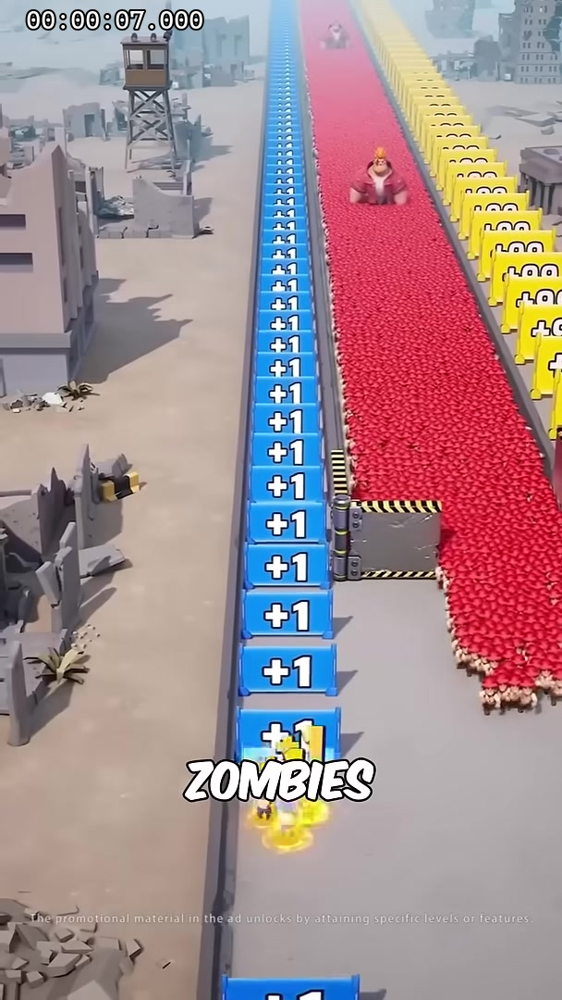

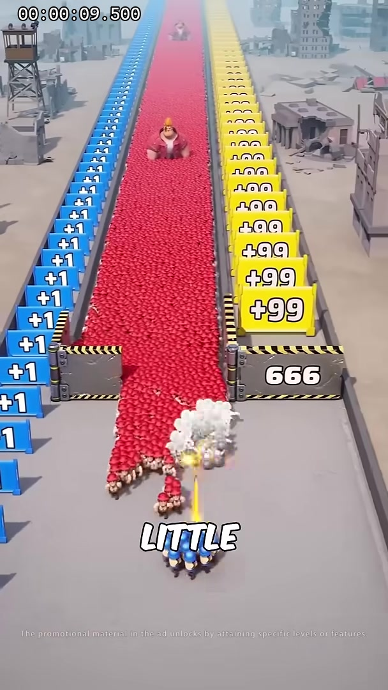

### 大循环

`1 名主角开局 → 打开 3 次攻击锁 → 领取 +N 蓝牌并即时增加 N 名小兵 → 队伍与枪线增长 → 达到 666 次攻击门槛 → 开放并领取更大数值的 +N 增员牌 → 自动集火 BOSS → 主角存活并获胜`

### 核心状态

| 状态 | 进入条件 | 玩家行为 | 自动行为 | 退出条件 |
| --- | --- | --- | --- | --- |
| Hook | 游戏加载完成 | 可立即横移 | 单主角前进、显示能力锁与首批敌人 | 玩家首次输入 |
| AutoFire | 敌人进入射程 | 横移选择站位 | 主角/小兵自动选取最近有效目标并攻击 | 某能力锁达标 |
| LockReady | `attackCount >= requiredHits` | 横移领取对应牌 | 牌面由锁定转为高亮，停止扣进度 | 与牌面接触 |
| Reinforce | 领取 `+N` 增员牌 | 继续横移 | 同帧增加 N 名小兵、重排队形、增加 N 份自动枪线 | 反馈完成 |
| Boss | 巨型僵尸进入射程 | 横移躲攻击区、选择剩余强化 | 小兵自动集火，主角持续攻击 | BOSS 死亡或主角死亡 |
| Win | BOSS HP 为 0 且主角 HP 大于 0 | 点击 CTA | BOSS 倒地、小队庆祝 | CTA |
| Fail | 仅 `playerHp <= 0` | 重试/CTA | 定格主角死亡反馈 | 重开或 CTA |

## 角色与道具

### 角色表

| 角色 | 功能 | 操作/AI | 动作拆解 | 制作要求 |
| --- | --- | --- | --- | --- |
| 主角 | 唯一玩家生命载体；初始唯一角色 | 玩家只控制横移；自动索敌攻击 | 横移、待机瞄准、射击、受击、死亡、胜利 | 主角死亡是唯一失败来源，必须始终可辨认 |
| 蓝衣小兵 | 通过两侧数字能力锁解锁的火力单位 | 跟随主角横移，自动寻找射程内目标并攻击 | 入队、编队移动、瞄准、射击、受击、退场 | 小兵死亡不能直接判失败 |
| 普通僵尸 | 提供攻击次数和推进压力 | 自动接近主角或沿道路推进 | 移动、受击、后仰、死亡 | 可批量实例化 |
| 巨型僵尸 | 终局 BOSS，直接威胁主角生命 | 自动接近并攻击主角所在横向区域 | 走路、蓄力、砸地、受击、硬直、死亡 | 独立血条与攻击预警 |

### 能力锁与特效表

| 对象 | 状态 | 交互 | 即时反馈 |
| --- | --- | --- | --- |
| 攻击次数锁 `3` | Locked / Opened | 累计 3 次有效攻击后打开 | 数字归零、蓝光爆发、开放后续蓝色增员牌 |
| 攻击次数锁 `666` | Locked / Opened | 累计 666 次有效攻击后打开 | 金色爆发、开放后续高数值增员牌 |
| 两侧 `+N` 增员牌 | Available / Taken | 玩家横移接触领取 | 按牌面数字 N 即时增加 N 名小兵 |
| 攻击次数 HUD | 显示累计攻击或最近能力锁剩余次数 | 每次有效攻击更新 | 数字跳动、接近门槛时加速闪烁 |
| 自动枪线 | 每个角色独立索敌 | 无需玩家点击 | 新角色加入后立即多出枪口火与弹道 |
| 主角 HP | 常驻显示 | 受敌人攻击降低 | 低血量红框；归零才失败 |

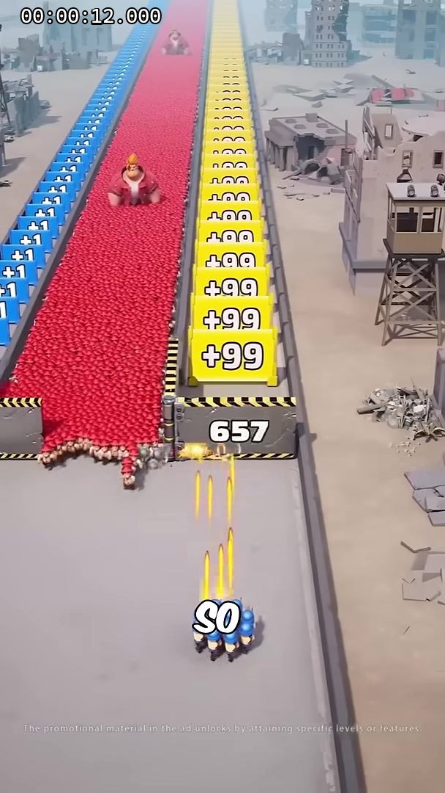

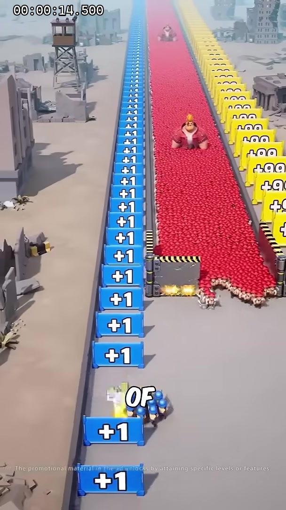

## 地编与镜头需求

### 竖屏布局

```text
┌──────────── 远景废城 / BOSS 锚点 ────────────┐
│ 蓝色 +N 增员牌    │ 中央僵尸与战斗区 │ 黄色 +N 增员牌    │
│  3 次攻击锁入口   │ 自动攻击接触线   │  666 次攻击锁入口 │
│                  │ 主角 + 已解锁小兵 │                   │
│                  │ 横向拖动安全区    │                   │
└──────────────── 390×844 Web 坐标 ────────────────┘
```

- **移动轴**：小队只有横向位移；没有玩家控制的前后移动、冲刺或跳跃。
- **纵向推进**：道路、敌人和能力牌向下滚动，形成向前跑酷感。
- **能力锁位置**：`3/666` 是对应区域入口的攻击次数锁；锁打开后，两侧 `+N` 数字牌才可领取。
- **相机**：固定斜俯视，FOV 38°-44°；主角位于屏高 78%-86%。
- **主角可读性**：即使队伍扩大，主角必须使用独特轮廓、脚底圈或头顶标记，方便识别唯一生命主体。
- **性能**：小兵和僵尸使用实例化；攻击次数与可视单位数分离，`666` 只表示门槛，不要求生成 666 个敌人或角色。

### 场景细节与交互逻辑

| 场景对象 | 制作要求 | 规则 |
| --- | --- | --- |
| 中央道路 | 灰米色末日道路，两侧废墟弱化 | 小队纵向位置固定，只能横移 |
| 左侧蓝色增员带 | 连续 `+N` 数字牌 | 领取一块立即增加 N 名小兵 |
| 右侧黄色增员带 | 连续 `+N` 数字牌 | 与蓝牌规则完全相同，只允许 N 更大 |
| 普通僵尸 | 分批进入自动索敌范围 | 攻击目标优先主角；不会因越线直接结算 |
| BOSS | 远景常驻，后段进入近景 | 攻击主角，主角死亡才失败 |
| 视觉底线 | 仅用于构图或警告 | 任何单位越线都不能直接触发失败 |

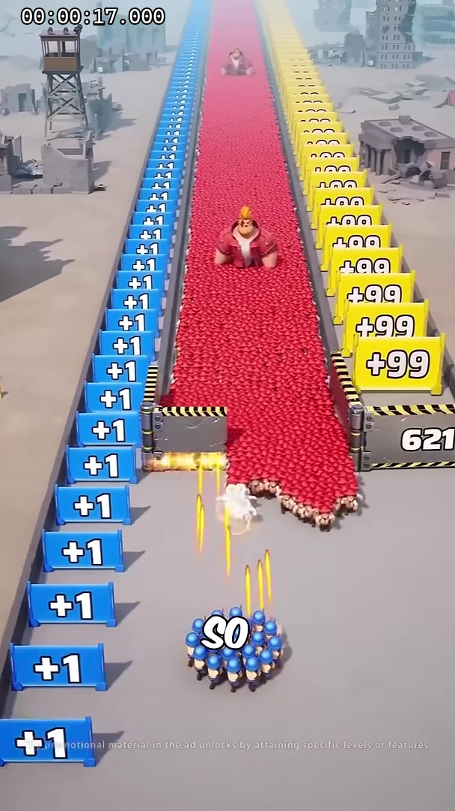

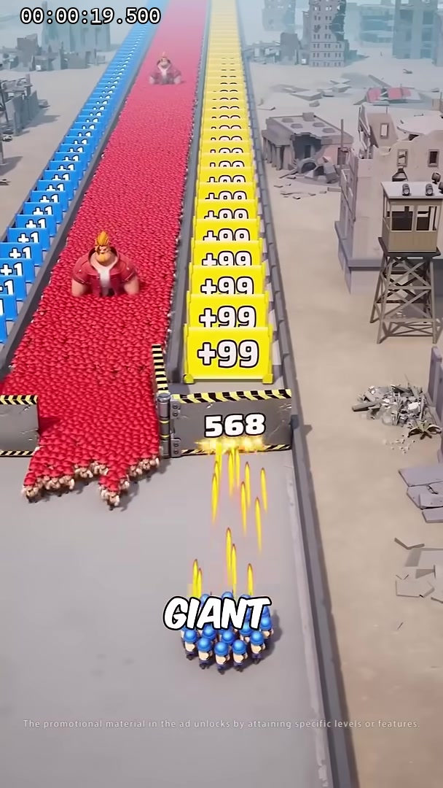

## 流程引导与演出时间轴

| 推荐时间 | 阶段 | 玩家任务 | 自动行为与反馈 | 证据帧 |
| --- | --- | --- | --- | --- |
| 0-1.2 秒 | 单主角开局 | 跟随手指左右拖动 | 主角自动攻击最近僵尸；首次命中显示 `1/3` | 00.0 秒 |
| 1.2-4 秒 | 3 次攻击锁 | 保持横向站位并完成 3 次攻击 | `3` 锁逐击扣减，达标后打开蓝色增员带 | 02.0 秒 |
| 领取蓝牌 | 横移接触 `+N` 蓝牌 | 主角只做横向移动 | 接触当帧增加 N 名小兵、队形扩大、增加 N 份枪线、HUD 数量加 N | 02.0-04.5 秒 |
| 4-14 秒 | 连续增员 | 左右领取已经开放的 `+N` 数字牌 | 每块牌只增加 N 名小兵；小兵立即自动索敌攻击 | 07.0-14.5 秒 |
| 14-22 秒 | 666 次攻击锁 | 持续攻击并打开 666 门槛 | 解锁后开放更大 N 值的黄色增员牌；领取仍只增加小兵 | 17.0-22.0 秒 |
| 22-30 秒 | BOSS 战 | 横移躲开 BOSS 预警区 | 小兵自动集火，主角持续输出；主角受击扣 HP | 22.0-29.5 秒 |
| 终局 | BOSS 死亡 | 无需额外输入 | 若主角存活则成功；若主角 HP 归零则失败 | 32.5 秒 |

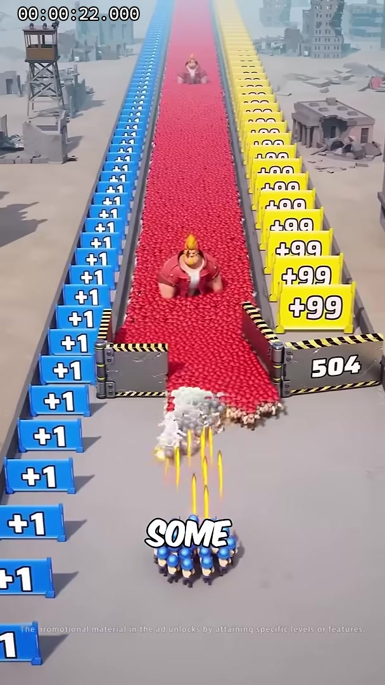

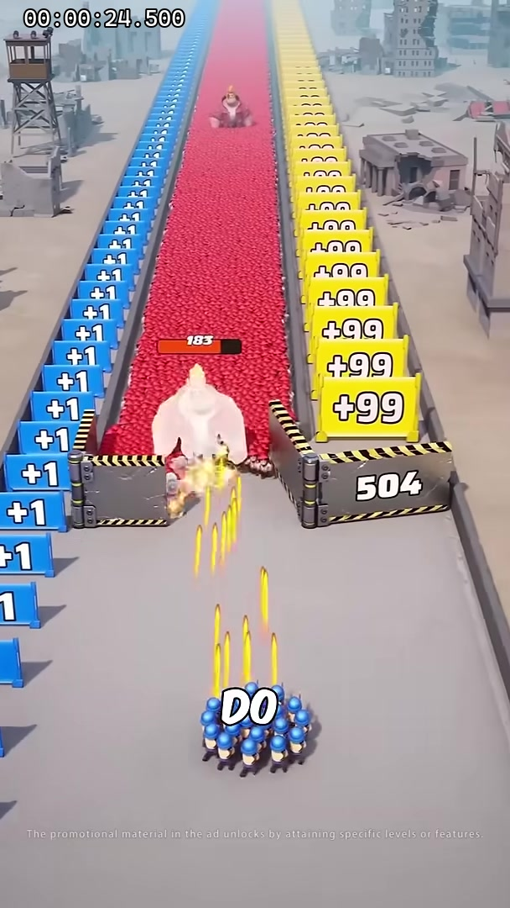

## 数值设计

### 大小关系原则

1. 初始角色固定为 1。
2. `3` 与 `666` 只作为攻击次数门槛，不写入敌人数量或初始人数。
3. 每次有效攻击只累计一次；多名小兵可并行攻击，使高阶门槛更快完成。
4. 任意 `+N` 数字牌领取后必须在 0.1 秒内增加 N 名小兵，并完成编队重排、人数 HUD 加 N 和新增枪线。
5. 小兵受击和死亡只影响火力；只有主角 HP 归零触发失败。
6. BOSS 伤害必须给玩家横向躲避空间，不允许无法规避的持续扣血。

### 建议首轮配置

| 配置项 | 建议值 | 说明 |
| --- | ---: | --- |
| 初始主角数量 | 1 | 用户确认 |
| 初始小兵数量 | 0 | 通过两侧 `+N` 数字牌获得 |
| 攻击计数方式 | 每次有效命中 +1 | 只用于打开 `3/666` 攻击次数锁 |
| 早期攻击锁 | 3 | 打开蓝色增员带 |
| 长期攻击锁 | 666 | 打开高数值黄色增员带 |
| 蓝牌增员 | `+N` 就增加 N 名小兵 | 领取后立即生效，不换算倍率 |
| 黄色牌增员 | `+N` 就增加 N 名小兵 | 规则与蓝牌相同，不附加技能 |
| 主角 HP | 100 | 唯一失败生命值 |
| 小兵 HP | 20 | 死亡仅从队伍移除 |
| 主角单发伤害 | 2 | 开局可独立完成 3 次攻击锁 |
| 小兵单发伤害 | 1 | 数量增长后形成火力提升 |
| 主角射速 | 2.0 发/秒 | 首次能力锁约 1.5 秒完成 |
| 小兵射速 | 1.8 发/秒 | 自动索敌 |
| BOSS HP | 200 | 对应可见 183、84 读数 |
| BOSS 攻击伤害 | 25 | 连续受击会导致主角死亡 |
| BOSS 蓄力时间 | 0.85 秒 | 给横移躲避窗口 |
| 推荐局长 | 24-30 秒 | 与原片节奏接近 |

### 敌人攻击机制

| 敌人 | 索敌与攻击 | 视觉预警 | 失败关系 |
| --- | --- | --- | --- |
| 普通僵尸 | 优先接近主角，进入近战范围后攻击 | 攻击前抬手 0.35 秒 | 仅命中主角并使 HP 归零时失败 |
| 快速僵尸 | 从侧面逼近主角横向位置 | 地面短红箭头 | 越过画面不直接失败 |
| 巨型僵尸 | 锁定主角所在横向区域砸地 | 0.85 秒红色矩形 | 砸中主角扣 HP；主角死亡才失败 |
| 小兵受击 | 可被敌人攻击并死亡 | 小兵血条短闪 | 不触发失败，只降低自动火力 |

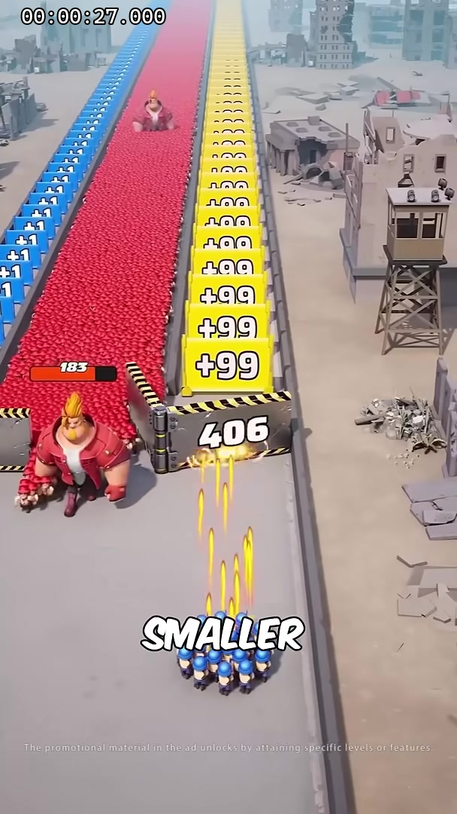

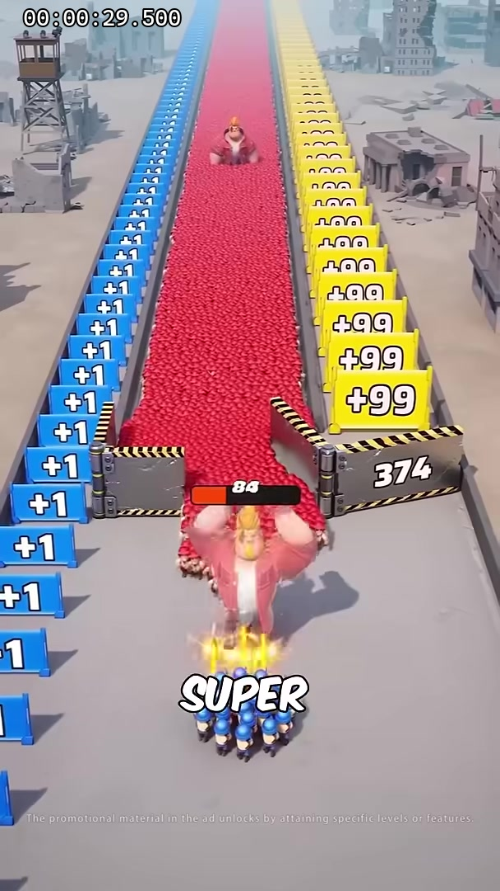

## UI 与引导按钮

### 常驻 HUD

| UI | 位置/样式 | 更新规则 |
| --- | --- | --- |
| 主角 HP | 左上，头像 + 绿色生命条 | HP 归零触发唯一失败 |
| 当前小兵数量 | 主角 HP 下方，蓝色小兵图标 + 数字 | 领取 `+N` 牌后同帧增加 N |
| 攻击次数 | 顶部中央，子弹图标 + 累计值 | 每次有效攻击更新 |
| 攻击锁进度 | `3/666` 锁显示剩余攻击次数 | 达标后打开对应增员带 |
| BOSS 血条 | BOSS 头顶 | 进入近景后显示 |

### 引导与反馈

| 状态 | 需求 | 文案/反馈 |
| --- | --- | --- |
| 未输入 | 白色手指左右拖动 | `DRAG TO MOVE` |
| 首次攻击 | 攻击次数 HUD 跳动 | `ATTACK TO UNLOCK` |
| `3` 锁达标 | 蓝牌解锁、呼吸高亮 | `UNLOCKED!` |
| 领取 `+N` 蓝牌 | 立即出现 N 名小兵、队形扩大、增加 N 份枪线 | 直接显示牌面 `+N` |
| `666` 锁推进 | 数字持续扣减/进度条填充 | 不显示为敌方数量 |
| 主角低血量 | 红框脉冲、HP 条闪烁 | `DANGER!` |
| 成功 | BOSS 倒地、小队庆祝 | `BOSS DEFEATED!` / `PLAY NOW` |
| 失败 | 主角死亡定格 | `HERO DOWN` / `TRY AGAIN` |

### 输入与适配

- 小队只允许横向移动，松手即停，禁止惯性滑行。
- 主角和全部小兵共享横向跟随目标，自动重排队形。
- 玩家不能点击敌人选目标；自动索敌优先顺序为：威胁主角的近敌 > BOSS > 其他近敌。
- 任意 `+N` 数字牌接触判定完成后，0.1 秒内生成 N 名小兵；不能改成火力倍率，也不能等到下一波或下一状态。
- UI 触摸区不驱动小队；390×844 Web 坐标映射至 720×1280。

## 画面、美术与动画清单

| 类别 | 资产 | 数量/变体 | 验收标准 |
| --- | --- | ---: | --- |
| 环境 | 末日道路、废墟、破楼、枯树 | 1 套 + 8 个散件 | 不遮挡两侧数字牌 |
| 主角 | 独特蓝衣角色 | 1 | 队伍扩大后仍能一眼识别 |
| 小兵 | 蓝衣自动射击单位 | 1 骨骼、5 个材质变体 | 自动转向目标，跟随横移 |
| 敌人 | 普通僵尸、快速僵尸 | 2 骨骼、多材质 | 不用 666 个实体表达能力锁 |
| BOSS | 巨型僵尸 | 1 | 独立攻击和死亡动作 |
| 攻击锁与增员牌 | `3/666` 攻击锁；蓝/黄 `+N` 增员牌 | 2 套锁 + 2 套牌 | 锁门槛与增员数量必须视觉区分 |
| 特效 | 自动枪线、命中烟、增员蓝光、解锁金光 | 6 套 | 领取蓝牌后立即可见变化 |
| UI | HP、小兵数、攻击次数、攻击锁进度、结算卡 | 1 套 | `+N` 只对应小兵数量 |

## 音效与音乐

| 音效 | 触发 | 设计要求 |
| --- | --- | --- |
| 自动射击 | 主角/小兵攻击 | 多样本轮换，人数增多不线性增大音量 |
| 有效命中 | attackCount 增加 | 轻反馈，不与枪声冲突 |
| 能力锁倒计数 | 接近门槛 | 最后 3 次逐步升调 |
| 能力解锁 | 门槛达成 | 明确的开锁与上扬音 |
| 蓝牌领取 | 接触能力牌 | 解锁音后立即接入队音 |
| 新角色入队 | 角色生成 | 短促口号 + 装备声 |
| 主角受击 | HP 降低 | 与小兵受击使用不同音色 |
| 主角死亡 | 唯一失败 | 音乐截断 + 低沉失败音 |
| BOSS 预警 | 砸地前 | 可依赖声音辅助横移躲避 |
| BOSS 死亡 | HP 归零 | 重物倒地 + 成功号角 |

## 模板映射（→ 代码落点）

### Runner 配置

| 配置组 | 字段 | 建议值 |
| --- | --- | --- |
| `player` | `initialCount / hp / moveRange / moveSmoothing` | `1 / 100 / [-286,286] / 0.08` |
| `movement` | `horizontalOnly / inertia` | `true / false` |
| `combat` | `autoTarget / hitCountMode / targetPriority` | `true / perHit / threat,boss,nearest` |
| `locks` | `requirements` | `[3,666]` |
| `locks` | `unlockMode` | `attackCount` |
| `recruitPlates` | `addCounts / claimMode / instantApply` | `按各牌面 N / touch / true` |
| `squad` | `initialMinions / visualCap / autoAttack` | `0 / 24 / true` |
| `boss` | `hp / attackDamage / telegraph / cooldown` | `200 / 25 / 0.85 / 3.2` |
| `fail` | `condition / retryCount` | `playerHp<=0 / 1` |

### 代码结构建议

- `RunnerInputModel`：仅输出连续横坐标，不提供前后移动。
- `AutoTargetCombatModel`：主角和小兵自动索敌、攻击和命中事件。
- `AttackCountLockModel`：记录累计攻击次数、每个门槛的 Locked/Ready/Taken 状态。
- `RecruitPlateModel`：识别 `+N` 牌面，接触后只派发 `addMinions(N)`，不派发伤害、射速或技能增益。
- `SquadModel`：初始 1 主角、0 小兵；领取增员牌后立即增加 N 名小兵并重排。
- `PlayerHealthModel`：唯一失败判定源。
- `BossModel`：HP、横向预警区、攻击和死亡。
- `BattleHudView`：主角 HP、小兵数量、攻击次数、能力锁进度。

### 必须实现

1. 初始只有 1 名主角。
2. 小队只能横向移动。
3. 主角和小兵自动索敌攻击。
4. `3` 与 `666` 必须实现为攻击次数能力锁，不能作为敌我数量。
5. 领取任意 `+N` 增员牌后只增加 N 名小兵，不直接增加伤害倍率、射速倍率或技能。
6. 主角死亡是唯一失败条件。

### 即时爽感硬指标

- 接触 `+N` 增员牌到人数 HUD 加 N：同一帧完成。
- 接触判定到 N 名小兵开始出现：不超过 100ms；禁止延迟到下一波、下一状态或回到中路后结算。
- 编队扩张与站位补齐：不超过 250ms；允许用短促弹出动画，但逻辑人数必须先即时生效。
- 新增小兵完成自动索敌并打出第一轮枪线：不超过 300ms。
- 同一次领取必须同步触发牌面破碎/吸收、`+N` 数字跳字、人数 HUD 跳动、入队音效、编队扩张和新增枪线，形成“碰到就变强”的单一反馈节拍。
- 不得用隐藏火力倍率代替可见的小兵实体；性能超过可视上限时，仍须即时更新逻辑人数，并用合并队列/叠影表现新增数量。

## 结算与广告生命周期

- 首次横移上报 `game_start`。
- 首次自动攻击上报 `first_attack`。
- `3` 能力锁达标上报 `first_unlock_ready`，领取后上报 `first_reinforcement`。
- `666` 能力锁达标上报 `ultimate_unlock_ready`。
- BOSS 死亡且主角存活上报成功；主角 HP 归零上报失败。
- 小兵死亡、敌人越线、错过牌或软超时不得上报失败。
- CTA URL、品牌 LOGO 和投放语言由广告主提供。

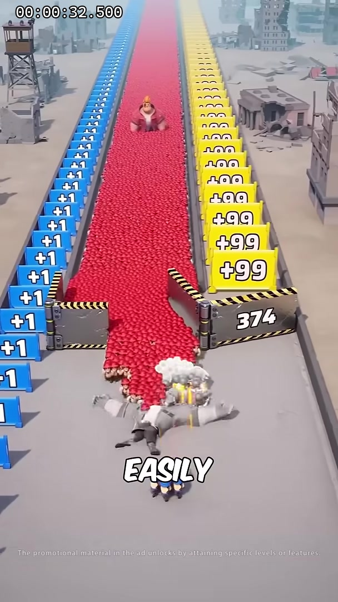

## 制作验收

- [ ] 开局只有 1 名主角，0 名小兵。
- [ ] 小队只响应横向拖动，松手即停。
- [ ] 主角和小兵会自动索敌、转向和攻击。
- [ ] 只有 `3` 与 `666` 是攻击次数能力锁。
- [ ] 两侧所有 `+N` 都是增员牌，领取后只增加 N 名小兵，不附加伤害、射速或技能。
- [ ] `3` 与 `666` 不使用敌我关系文案、颜色或 HUD 标签。
- [ ] 领取任意 `+N` 牌时，人数 HUD 同帧加 N，100ms 内开始生成，250ms 内完成编队反馈。
- [ ] 新增小兵在 300ms 内完成索敌并参与自动攻击。
- [ ] 小兵死亡、敌人越线、错过能力牌不会触发失败。
- [ ] 只有主角 HP 归零触发失败。
- [ ] BOSS 死亡且主角存活触发成功。
- [ ] 14 张关键帧均能解析，正文不存在把 `3` 和 `666` 当作敌对数量的逻辑。
