# 试玩广告脚本：Palmon 捕获经营基地

> 来源：YouTube Shorts `uC_m1Lfx42U`，58 秒竖屏视频，360×640，30 FPS。  
> 目标：把“外出捕获怪物 - 回城交付 - 获得金币 - 扩建围栏与捕获设施 - 挑战高等级怪物”压缩为一局可完成的 3D playable。

## 封面

- **玩法卖点**：模拟经营 + 怪物捕获 + 基地扩建
- **核心操作**：虚拟摇杆移动；进入捕获范围后，载具自动牵引并削减怪物耐力；捕获后自动装车；回到基地自动卸货或出售。
- **大纲**：
  1. 用近景“处理怪物”冲突画面吸引注意，立即切入俯视角实玩。
  2. 玩家把首批捕获物送进商店，获得金币，理解“捕获 - 变现”循环。
  3. 玩家驾驶基础捕获车到围栏外捕获 Lv1 怪物，装满后回基地。
  4. 用金币解锁价值 30 的围栏槽位和自动捕获岗位，基地逐步扩张。
  5. 捕获车升级后可以牵引 Lv3 大型怪物，形成强烈战力兑现。
  6. 把 Lv3 怪物送入最终围栏并装满两座兽栏，触发成功结算与 CTA。
- **成功条件**：两座围栏达到容量上限，并成功捕获 1 只 Lv3 怪物。
- **失败条件**：载具耐久归零或高等级怪物脱离牵引 3 次；允许复活重试 1 次。


## 参考视频

| 文件/链接 | 时长/规格 | 备注 |
| --- | --- | --- |
| `reference/incoming/youtube-uC_m1Lfx42U.mp4` | 57.96 秒，360×640，30 FPS，AV1 + AAC | 已成功下载并逐段取证 |
| `https://www.youtube.com/shorts/uC_m1Lfx42U` | YouTube Shorts | 标题：Palmon Survival Ads Review 05 |

### 关键画面总览

| 时间 | 画面事件 | 制作结论 |
| --- | --- | --- |
| 0-4 秒 | 角色举锤处理倒地怪物 | 作为短促冲突钩子，不做可交互玩法 |
| 4-8 秒 | 满载捕获车进入商店，出现 `Sell` 和金币柱 | 明确主循环的交付与变现终点 |
| 8-16 秒 | 基础捕获车在红色范围内牵引 Lv1/Lv3 怪物 | 捕获是持续范围交互，不是点击战斗 |
| 16-24 秒 | 回基地卸货；两个 30 金币解锁位常驻 | 目标链通过价格牌自然引导 |
| 24-36 秒 | 围栏外怪物变多，基地入口形成双通道 | 中期扩产与容量压力 |
| 36-48 秒 | 捕获车升级，进入 Lv3 大怪群 | 战力兑现与高潮 |
| 48-58 秒 | 大怪被拖入基地，兽栏容量明显增长 | 以装满围栏作为 playable 终局 |

## 分析结论

- **目标结构（动机轴）**：解压经营型。小循环是“靠近 - 自动牵引 - 装车 - 卸货”，大循环是“卖出 - 获得金币 - 解锁设施 - 扩大捕获等级与容量”。
- **操作归属**：主角移动必须由玩家持续拖拽摇杆；牵引、装车、卸货属于进入范围后的自动交互；设施自动工作必须由玩家购买后才启用。
- **目标链**：首只 Lv1 → 首次出售 → 左围栏 30 → 右围栏 30 → 捕获车升级 60 → 捕获 Lv3 → 两围栏装满。所有价格牌开局或解锁阶段即在场，不按绝对秒数强制触发。
- **长期锚点**：围栏外从开局就可见的 Lv3 大型怪物，以及基地内两个空兽栏。玩家能提前看到“以后可以抓什么、要把基地扩成什么样”。
- **地图尺度**：角色高度约占屏幕 8%-10%，竖屏地图分为上方野外捕获区、中部城墙与入口、下方基地经营区三层。
- **模板映射**：优先采用 3D `crew` 模块层；复用目标牌、范围自动交互、搬运/入库和目标链，新增 `CaptureSim`、`CaptureVehicleModule`、`PenModule`。

## 资源循环

### 循环 1：捕获与交付

`玩家移动到怪物附近 → 捕获圈锁定 → 持续牵引削减耐力 → 怪物装入载具 → 返回基地 → 自动卸货`

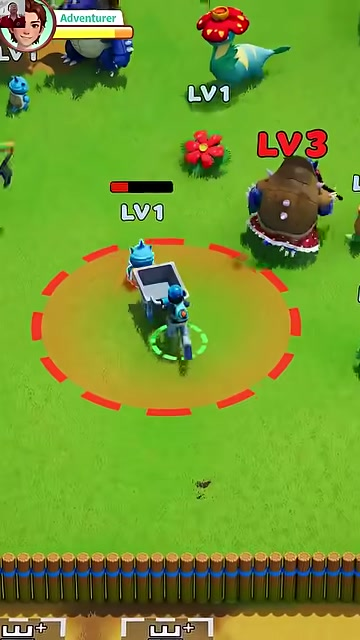

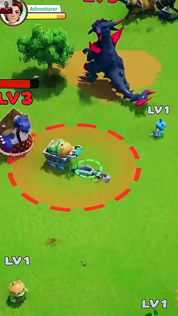

### 循环 2：出售与扩建

`卸货/出售怪物 → 金币柱增长 → 踩上价格牌投入金币 → 解锁围栏或自动岗位 → 容量与捕获效率提升`

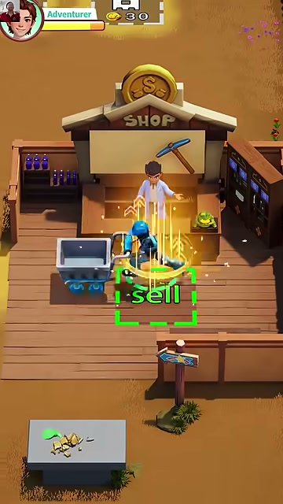

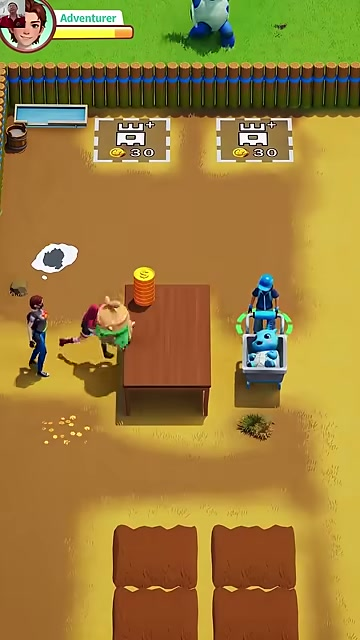

### 大循环

`捕获 Lv1 → 解锁首座围栏 → 增加容量 → 解锁第二围栏 → 升级捕获车 → 捕获 Lv3 → 装满基地 → 结算 CTA`

| 资源 | 来源 | 容器/HUD | 消耗点 | 反馈 |
| --- | --- | --- | --- | --- |
| 金币 | 商店出售捕获物 | 左上角金币数 + 场内金币柱 | 围栏、自动岗位、载具升级 | 金币飞向目标牌，绿色进度填充 |
| 捕获物 | 野外 Lv1-Lv3 怪物 | 载具可视堆叠 + 容量 `x/y` | 商店出售或投入围栏 | 怪物缩放吸入、车斗堆叠 |
| 围栏容量 | 建造/升级兽栏 | 围栏上方 `x/y` | 收容捕获物 | 围栏内模型数量持续增加 |
| 牵引力 | 载具升级获得 | 捕获圈颜色与等级图标 | 对抗怪物耐力 | 光束变粗、圈由红转绿 |

## 角色&道具

### 角色表

| 角色名 | 说明/图片参考 | 角色功能 | 动作拆解 | 模型资产引用 |
| --- | --- | --- | --- | --- |
| 冒险者（玩家） | 蓝色头盔、深色上衣 | 驾驶捕获车、交付捕获物、踩价格牌 | 待机、跑动、推车、驾驶、受击、庆祝 | `assets/art/palmon/player` |
| 商店老板 | 白衣 NPC，站在 Shop 柜台后 | 接收捕获物并结算金币 | 待机、接货、挥手 | `assets/art/palmon/shopkeeper` |
| 围栏管理员 | 站在城墙高台的蓝色 NPC | 玩家购买后自动牵引靠近入口的怪物 | 待机、抛绳、牵引、收绳 | `assets/art/palmon/ranger` |
| Lv1 小怪 | 蓝色小兽、花朵兽、小鸟兽 | 低耐力、基础售价，承担教学 | 游走、受牵引、挣扎、被吸入、围栏待机 | `assets/art/palmon/creature_l1_*` |
| Lv3 大怪 | 狼人、犀牛、巨型兽 | 高耐力、高售价，终局目标 | 巡逻、冲撞、挣扎、倒地、被拖行 | `assets/art/palmon/creature_l3_*` |

### 道具表

| 道具名称 | 说明/图片参考 | 备注 |
| --- | --- | --- |
| 基础捕获车 | 灰色车斗 + 牵引装置 | 容量 3，只能稳定捕获 Lv1 |
| 升级捕获平台 | 蓝色悬浮底盘 + 双牵引光束 | 容量 6，可捕获 Lv2/Lv3 |
| 金币柱 | 以实体堆叠显示当前可用金币 | 高度随金额变化，增强经营反馈 |
| 价格牌 | 白色虚线方框、设施图标、金币与价格 | 站上后持续投入，不用弹窗 |
| 围栏兽栏 | 白框槽位，捕获物以模型堆叠 | 两座围栏是终局进度的视觉载体 |
| 商店 | 木制西部商店，门前绿色 `Sell` 区 | 主循环交付终点 |

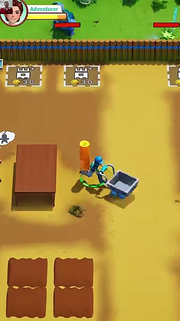

## 地编需求

### 布局参考

竖屏固定斜俯视相机，玩家上下往返即可完成主循环：

```text
┌──────────────────────┐
│ 野外：Lv1 散布区      │
│ Lv3 长期目标 / 树木   │
├────高台────门────高台─┤
│ 围栏 A  捕获入口 围栏 B│
│ 30 金币牌      30 金币牌│
│        金币柱          │
│ 工作台        商店     │
│ 四块预留扩建地         │
└──────────────────────┘
```

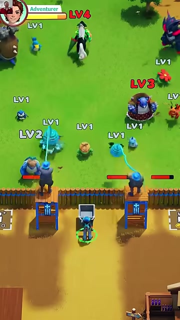

### 场景细节&交互逻辑

| 建筑/道具 | 说明（含交互与物理规则） | 参考图片 |
| --- | --- | --- |
| 整体环境 | 白天高饱和草地与黄土地；基地用木桩围墙分隔；阴影柔和，怪物轮廓必须清晰 | frame-05 |
| 野外捕获区 | Lv1 靠近入口，Lv3 位于更深处；怪物之间保持 1.2-2 个角色宽度 | frame-03/12 |
| 基地入口 | 双高台形成漏斗；玩家和载具可通行，未被捕获怪物不能穿墙 | frame-07/08 |
| 捕获范围 | 半透明橙色圆 + 红色虚线边；有效牵引后逐步转绿 | frame-03/04 |
| 商店 | 载具进入绿色 `Sell` 区即卸货；金币沿抛物线飞入金币柱 | frame-02/10 |
| 围栏 | 白色边界内显示真实怪物堆叠；满容量后产生闪光与升级箭头 | frame-09/13 |
| 价格牌 | 白色未激活、绿色投入中、金色完成；价格始终可读 | frame-05 |
| 边界 | 相机跟随玩家但保持基地入口在中下区域；地图外缘用树和大型怪物软封锁 | frame-11 |

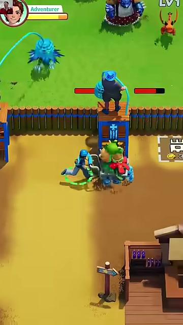

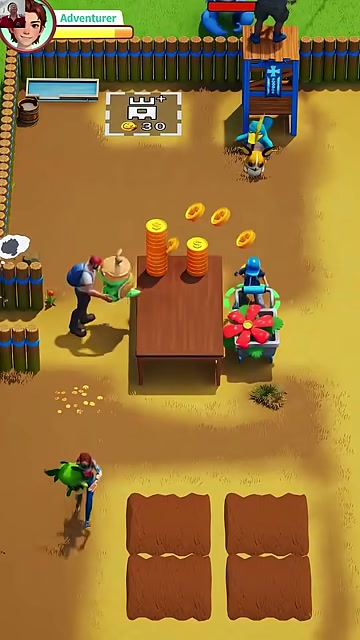

## 流程引导&数值设计

### 流程引导

| 时间节点 | 描述说明 | 画面参考 |
| --- | --- | --- |
| 0-2 秒：冲突钩子 | 近景锤击倒地怪物，镜头轻震；2 秒内切换实玩 | frame-01 |
| 首次交付 | 满载车辆已在 Shop 门前；手指短拖让玩家进入绿色 `Sell` 区 | frame-02 |
| 首次捕获 | 蓝色路线指向最近 Lv1；进入范围后显示耐力条与持续牵引 | frame-03 |
| 首次回城 | 车斗装满时箭头指向入口；进入基地后指向商店 | frame-05 |
| 首次解锁 | 获得 30 金币后，左侧围栏牌发光；脚下路线只提示、不自动走位 | frame-05 |
| 扩产阶段 | 首围栏启用后，右围栏和载具升级牌同时在场，由价格自然引导 | frame-07 |
| 高潮 | 升级载具同时牵引两只 Lv3，光束、震屏和金币预览强化反馈 | frame-12 |
| 终局 | Lv3 被拖入围栏，两侧容量满；停顿 0.8 秒后弹成功卡 | frame-13/14 |

### 数值设计

数值优先维持以下大小关系：

1. 首只 Lv1 售价足以完成第一个 30 金币解锁。
2. 第二围栏成本高于第一围栏，但不超过两趟基础载具收益。
3. 捕获车升级成本高于两座围栏，迫使玩家先理解经营循环。
4. Lv3 售价至少为 Lv1 的 4 倍，使终局捕获具有明确价值。
5. Lv3 耐力高于基础车能力，未升级时只能短暂牵引、不能完成捕获。

| 配置项 | 建议值 | 设计作用 |
| --- | --- | --- |
| 开局金币 | 0 | 强制完成首次出售教学 |
| Lv1 耐力 / 售价 | 12 / 30 | 一只即可解锁首围栏 |
| Lv2 耐力 / 售价 | 28 / 55 | 中段过渡 |
| Lv3 耐力 / 售价 | 65 / 120 | 高潮与终局收益 |
| 基础车牵引 DPS | 10/s | 约 1.2 秒捕获 Lv1 |
| 升级车牵引 DPS | 22/s | 约 3 秒捕获 Lv3 |
| 基础车容量 | 3 | 形成频繁往返 |
| 升级车容量 | 6 | 中后段明显提效 |
| 左围栏成本 / 容量 | 30 / 4 | 第一次购买 |
| 右围栏成本 / 容量 | 45 / 4 | 第二次购买 |
| 自动管理员成本 | 60 | 玩家购买后的自动化 |
| 捕获车升级成本 | 90 | 进入 Lv3 阶段的门槛 |
| 玩家耐久 | 100 | 允许承受 3-4 次冲撞 |
| Lv3 冲撞伤害 | 28 | 形成可见风险但不秒杀 |

### 怪物攻击机制

| 阶段 | 行为 | 玩家应对 |
| --- | --- | --- |
| Lv1 | 在小范围游走，受牵引时逃离圆心，不主动攻击 | 保持在范围内持续追随 |
| Lv2 | 受牵引 1 秒后进行一次横向冲刺 | 调整走位，不让牵引线断开 |
| Lv3 | 每 2.4 秒蓄力冲撞载具；撞墙后短暂眩晕 | 诱导撞墙，在眩晕期高效捕获 |
| 失败 | 玩家耐久归零或连续 3 次脱线 | 第一次失败可复活，保留已建设施 |

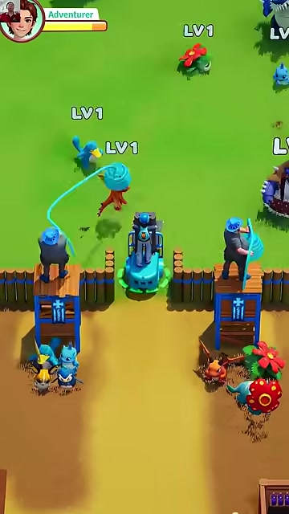

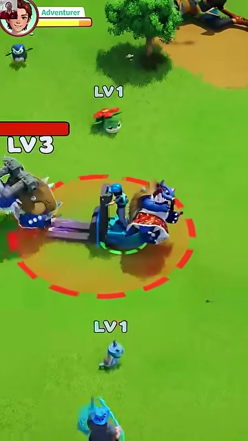

## UI&引导按钮

| 需求描述 | 表现规范 | 备注 |
| --- | --- | --- |
| 玩家状态 | 左上角头像、`Adventurer` 标签、绿色耐久条 | 沿用视频位置 |
| 金币 HUD | 左上或右上固定金币图标 + 数字 | 与场内金币柱同步 |
| 怪物等级 | 头顶 `LV1/LV2/LV3`，高等级用红字 | 进入屏幕即显示 |
| 怪物耐力 | 被锁定时才显示红色横条 | 清空后进入捕获动画 |
| 捕获范围 | 橙色半透明面 + 红色虚线圆 | 目标有效时变绿 |
| 牵引线 | 蓝色曲线连接装置与目标 | 断线前 0.3 秒闪烁警告 |
| 载具容量 | 车斗上方 `2/3` 或 `5/6` | 装满后变金并指向基地 |
| 解锁牌 | 设施图标、`+`、金币价格 | 站上持续支付 |
| 操作引导 | 首次显示白色手指与短拖轨迹 | 玩家输入后隐藏 |
| 失败界面 | `CAPTURE FAILED` + `REVIVE` | 只允许一次复活 |
| 成功界面 | `BASE COMPLETE!` + `PLAY NOW` | 背景保留装满的两座围栏 |

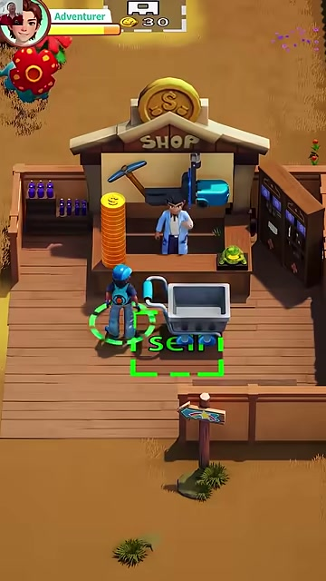

## 音效

| 音效描述 | 触发时机 | 设计要求 |
| --- | --- | --- |
| 牵引启动 | 首次锁定怪物 | 短促电子吸附声 |
| 牵引持续 | 牵引线有效期间 | 低音循环，耐力越低音高越高 |
| 捕获完成 | 怪物吸入车斗 | “咻”声 + 清脆确认音 |
| 怪物挣扎 | Lv2/Lv3 反抗 | 低频兽吼，不遮挡反馈音 |
| 载具装满 | 达到容量上限 | 三连提示音 |
| 卸货/出售 | 进入 Shop 或围栏 | 木箱落地 + 金币连响 |
| 投入金币 | 站在价格牌上 | 按枚连续播放，完成时升调 |
| 建造完成 | 围栏或岗位出现 | 木结构搭建 + 亮闪 |
| 载具升级 | 蓝色平台生成 | 机械展开 + 能量启动 |
| 受击警告 | 耐久低于 30% | 心跳与红框脉冲 |
| 成功 | 两围栏满且 Lv3 入栏 | 上扬号角 + 怪物欢呼 |
| 失败 | 耐久归零 | 设备熄火 + 低沉落音 |

## 模板映射（→ 代码落点）

| 配置项 | 值 | 视频/脚本依据 |
| --- | --- | --- |
| `player.moveSpeed` | 4.6 | 往返距离需在 6-8 秒内完成 |
| `capture.radius` | 2.3 / 3.0 | 视频中红圈约为角色身高 2.5 倍 |
| `capture.tierDps` | 10 / 22 | 低级秒抓、高级约 3 秒 |
| `vehicle.capacity` | 3 / 6 | 小车与升级车有明显容量差 |
| `creatures.tiers` | Lv1/Lv2/Lv3 | 视频头顶等级清晰可见 |
| `pens` | 30×4 / 45×4 | 两个基地槽位与 30 金币画面依据 |
| `upgradeCost` | 90 | 高于两座围栏成本 |
| `goal` | 两围栏满 + 1 只 Lv3 | 对应视频末段画面 |
| `ctaText` | `PLAY NOW` | 广告通用文案，投放前可替换 |

### 模块清单

- `framework/EventBus`：捕获、卸货、购买、围栏进度和结算事件。
- `modules/movement/PlayerMoveModule`：虚拟摇杆与相机跟随。
- `modules/capture/CaptureSim`：耐力、牵引、断线、装车纯逻辑。
- `modules/capture/CaptureVehicleModule`：范围圈、牵引线、车斗可视堆叠。
- `modules/creatures/CreatureSim`：等级、游走、逃离和冲撞。
- `modules/base/PenModule`：容量、模型排列、满栏反馈。
- `modules/economy/SellZoneModule`：卸货、金币飞行和金币柱。
- `modules/goals/PurchasePadModule`：驻留支付与设施解锁。
- `playables/palmon/PalmonConfig.ts`：全部数值、文案和 CTA。
- `playables/palmon/PalmonGame.ts`：模块注入、目标链和成功/失败结算。

### 与现有模板的差异点

1. `crew` 的“采集物”要替换为有耐力和反抗行为的怪物实体。
2. 搬运不是背后堆叠，而是载具容量与车斗中的可视堆叠。
3. 增加持续牵引线、断线判定和高等级怪物冲撞。
4. 围栏既是存储容器，也是全局目标进度的可视化。
5. 视频没有展示结算卡；playable 需在装满围栏后补充成功 CTA。

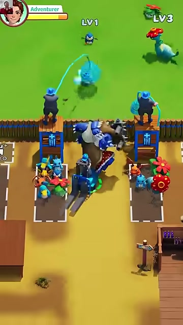

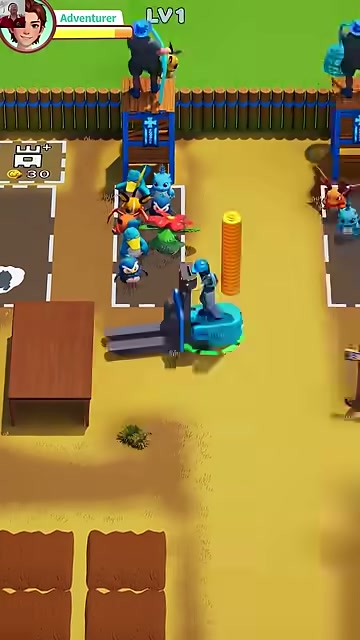

## 制作验收

- [x] 真实源视频已下载并记录规格。
- [x] 14 张代表帧已嵌入正文。
- [x] 核心小循环、大循环、操作归属和目标链明确。
- [x] 角色、道具、地编、UI、音效和数值均有制作落点。
- [x] 已选择 `crew` 3D 模块化结构并列出新增模块。
- [ ] CTA URL、品牌 LOGO 和最终语言由投放方提供。
- [ ] 绝对数值需在首轮可玩构建中根据 45-60 秒目标时长复调。
